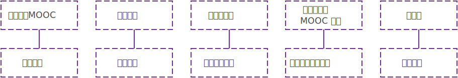

# 简介

## Course Crawler

一个基于 Python 3 的 MOOC 课程内容获取工具，方便离线观看。

支持 [中国大学MOOC](https://www.icourse163.org/)、[学堂在线](http://www.xuetangx.com/)、[网易云课堂 MOOC 课程](http://mooc.study.163.com/)、[好大学在线](https://www.cnmooc.org/)、[爱课程](http://www.icourses.cn/)。

结构齐全、命名规范，可以很方便定位和查找。

[下载最新程序](https://github.com/Foair/course-crawler/archive/master.zip) 或 [前往 GitHub](https://github.com/Foair/course-crawler)

## 中文 MOOC 平台

**中国大学MOOC** 是国内优质的中文 MOOC 学习平台，由爱课程网携手·网易云课堂·打造。大多数的名校都有一定数量课程，如北京大学、浙江大学、哈尔滨工业大学等。

**学堂在线** 是清华大学发起的精品中文慕课平台。主要是 **清华大学** 的课程。

**好大学在线** 是上海交通大学拥有的中国顶尖慕课平台。主要是 **上海交通大学** 等大学或机构的课程。

**网易云课堂 MOOC 课程** 主要是 [顶尖中文大学计算机专业课程体系](http://study.163.com/curricula/cs.htm) 和 [深度学习工程师微专业](http://mooc.study.163.com/smartSpec/detail/1001319001.htm) 等课程。

**爱课程** 网的资源多，但总体比较陈旧。

