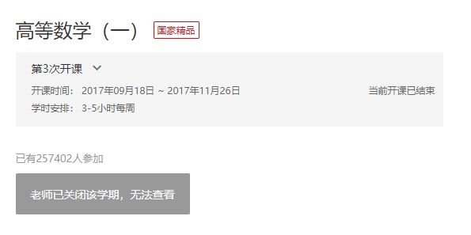
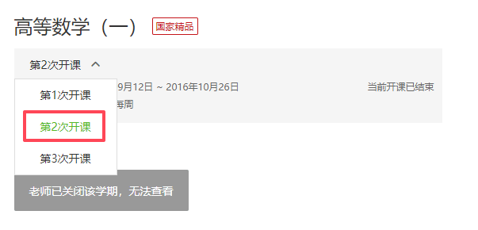

# 中国大学MOOC

## 地址格式

课程的地址必须类似以下两种格式

```text
https://www.icourse163.org/course/TONGJI-53004
https://www.icourse163.org/course/TONGJI-53004?tid=1001770008
```

## 开课次数

下方是最新一次开课的截图，地址最后没有 `?tid=1001770008`。（第 3 次开课）



下方是第 n 次开课的截图，有 `?tid=1001770008`。（`1001770008` 是第 2 次开课的学期代号。）



两者的区别就是开课次数的不同。第一个是最新一次开课，第二个是第 n 次开课。

一般来说，不管是第几次开课，课程的内容变化都不大。

?> 当然是有少许例外的，这些课程跟开课次数关系比较大，比如《形势与政策》和一些重新录制的课程。

如果遇到某个课程没有更新完，可以切换到上一次开课，这样就可以获取到全部的课件了。

?> 部分新开的课程（仅有一次开课且课程没有更新完）是没有办法获得完整课件的。我也没有时光机器。

## 碎碎念

「老师已关闭该学期，无法查看」暂时无所畏惧。

找不到开课页面的话，可以先进入课程的公告页面，然后点击课程名。

对于《形势与政策》，切换到不同开课次数，会获得完全不同的内容。

暂时不需要身份认证（cookies）。
