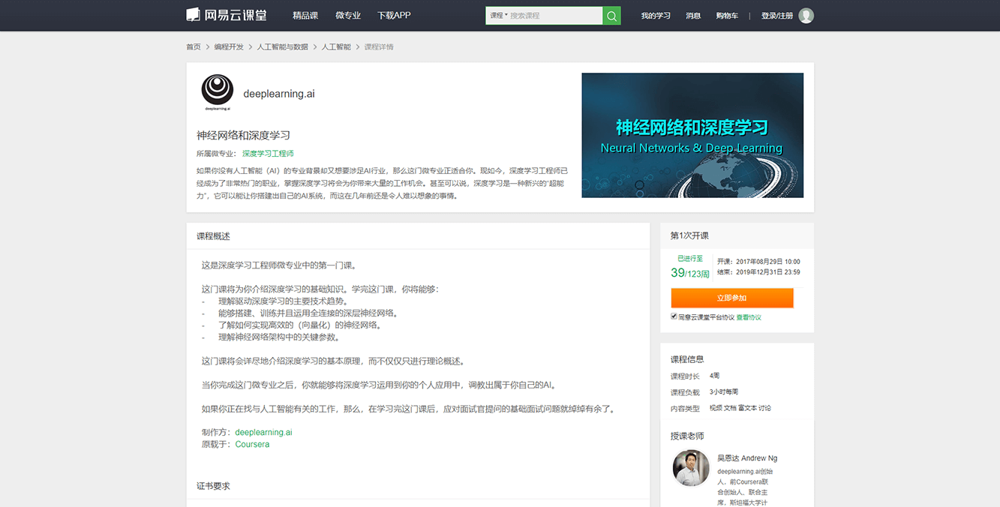
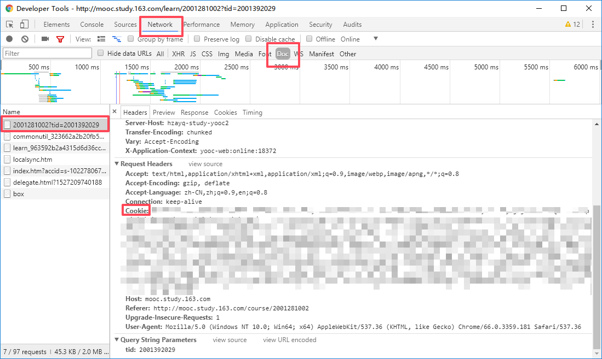

# 网易云课堂 MOOC 课程

## 地址格式

课程的地址必须类似以下两种格式

```text
http://mooc.study.163.com/course/2001281002#/info
http://mooc.study.163.com/course/2001281002
```

!> 无法适用于·网易云课堂·的普通课程，只适用于 `mooc.study.163.com` 域下的课程。



简而言之，只能是如上图所示界面的课程。

## 身份认证

网易云课堂·必须使用 cookies 登录才能获得课程。

用浏览器进入·网易云课堂·的首页，然后登录自己的账户。

打开一个 MOOC 课程的页面，比如 [神经网络和深度学习 - 网易云课堂](http://mooc.study.163.com/course/2001281002)。

按下 `F12`，然后切换到 `Network` 选项卡，然后点击「已参加，进入学习」。

回到开发者工具 `Network` 那里，选择 `Doc`，点第一个。然后往下滚动，复制 `Cookie:` 后面的内容。



## 碎碎念

和·中国大学MOOC·一个框架。

需要身份认证，没有·中国大学MOOC·那样优厚的条件。

你的账号本身就无法访问到的内容，程序也无法替你办到。

找不到开课页面的话，可以先进入课程的公告页面，然后点击课程名。（特别是吴恩达的那个）

名字太长，后面就简写成「网易云课堂 MOOC」了。
