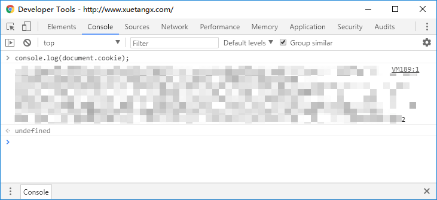

# 学堂在线

## 地址格式

课程的地址必须类似以下格式

```text
http://www.xuetangx.com/courses/course-v1:TsinghuaX+00740043_2x_2015_T2+sp/about
```

最后有一个 `about`，必须是这样的地址。

## 身份认证

学堂在线·必须使用 cookies 登录才能获得课程。

在浏览器中登录后，按 `F12`，在浏览器控制台中执行

```javascript
console.log(document.cookie);
```

然后复制输出的内容。



在调用程序获取课程的时候，会自动要求输入 cookies，粘贴便是。

随后会在程序目录创建 JSON 格式的 cookies 文件，仅在失效的时候会重新要求输入 cookies。

## 碎碎念

由于·学堂在线·返回都是整个 HTML 页面，所以比较慢。
